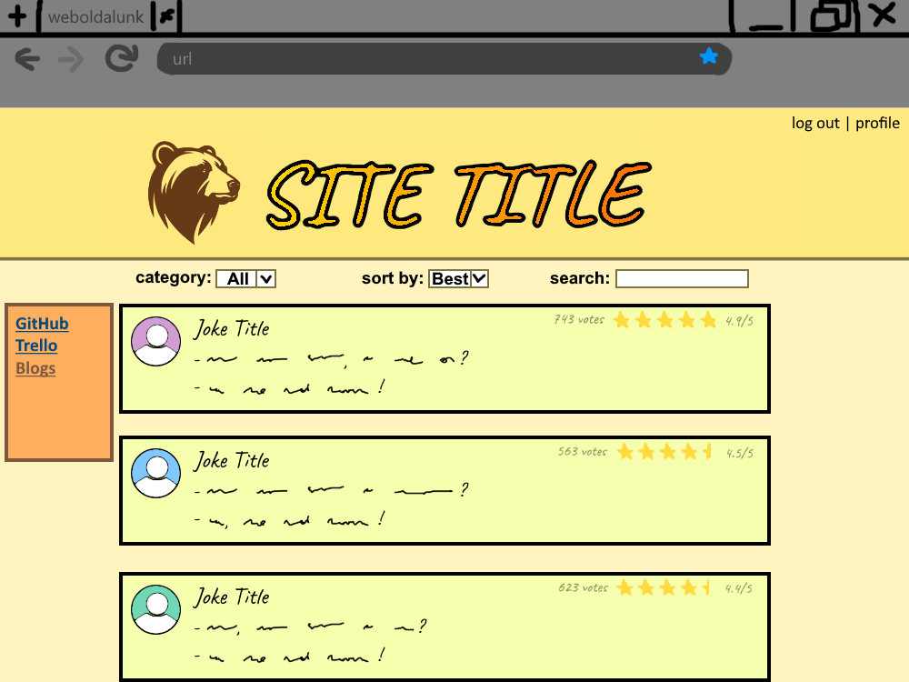

# Functional Specification

## 1. Current Situation
See here: https://github.com/KolozsiZsombor/SzoftverModszerMiniProject/blob/main/docs/Requirement%20Specification.md#1-current-situation

## 2. Dream Situation
See here: https://github.com/KolozsiZsombor/SzoftverModszerMiniProject/blob/main/docs/Requirement%20Specification.md#2-dream-situation

## 3. Current Business Model
See here: https://github.com/KolozsiZsombor/SzoftverModszerMiniProject/blob/main/docs/Requirement%20Specification.md#3-current-business-modell

## 4. Desired Business Model
See here: https://github.com/KolozsiZsombor/SzoftverModszerMiniProject/blob/main/docs/Requirement%20Specification.md#4-desired-business-modell

## 5. Laws and Requlations the systems must adhere to
See here: https://github.com/KolozsiZsombor/SzoftverModszerMiniProject/blob/main/docs/Requirement%20Specification.md#5-laws-and-regulations-the-systems-must-adhere-to

## 6. List of Requirements
See here: https://github.com/KolozsiZsombor/SzoftverModszerMiniProject/blob/main/docs/Requirement%20Specification.md#6-list-of-requirements

## 7. Use Cases
### 7.1 Users
Visitors of the site will be able to display it, and see the top rated jokes without an account. They should be able to sort by rating or recency, filter for category, and search content. Registered users should be able to share jokes, set one or more category for their posts, and delete their own jokes. They should also be able to rate other people's jokes.

### 7.2 Admins
Users with administrator privilages should be able to do everything general users can, plus edit or delete other users' posts, if they contain inappropriate content. Admins should be able to display a table of all registered users.

## 8. Display Plans
### 8.1 Home page
The first page a new visitor will see of the site. Users will see the top rated jokes in the middle, with filters, sorting, and search bar above the main area. At the corner of the page, they will see the register and log in buttons. If the user is logged in, instead they will see the log out, and profile buttons. Clicking on the site logo will reload the page.
#### 8.1.1 User view
See visual plan here: [8.3.1 User view]
Users can rate jokes by clicking on a star. Click on the left-most star for a 1-star (poor) rating, click on the right-most star for a 5-star (perfect) rating.

#### 8.1.2 Admin view
See visual plan here: [8.3.2 Admin view]
Beyond all the things general users can do, administrators have delete and edit buttons. On the top of the site, next to the log out button, the admins will see a red notification, if there are new jokes waiting to be approved.

### 8.2 User profile
The profile page of a registered user will display the jokes they posted, in chronological order (newest first). Clicking on the site logo will take the user back to the home page.

### 8.3 Attachments

#### 8.3.1 User View

#### 8.3.2 Admin View

## 9. Scenarios
### 9.1 User's point of view
Bob thought of a funny joke, and would like to share it with the world. He registers an account on the website, and submits his joke.

### 9.2 Admin's point of view
Before any newly submitted joke appears publicly on the site, an admin has to approve it. One of the adminstrators logs into the site, and sees that user 'Bob' has submitted a joke. He reads it, finds no inappropraite material, and approves the submission. The joke can now be read by all visitors.

## 10 Function - requirement correspondence
